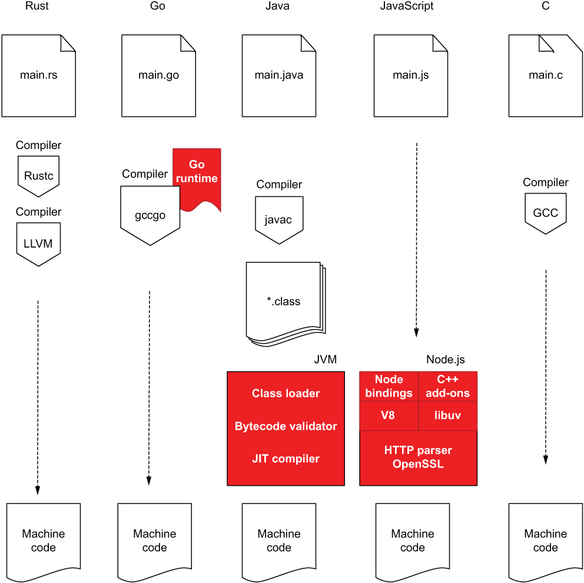
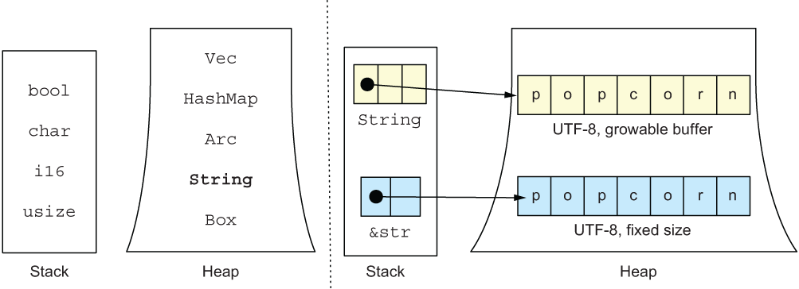

# Why Rust
A brief overview as to why I have chosen Rust to support my web server as a microservice.

## Key Points
- **systems programming language** (not interpreted language)
    - has a compiler
- no **overhead** (e.g. no garbage collection)
- easy-to-read syntax
- offers performance like **C**
- safety (memory-safe)
- productivity
    - built-in tooling is great for **maintainability**:
        - testing
        - documentation
        - package manager
- versatile
- can compile to WebAssembly

## Rust Toolings
> Batteries Included

| Purpose | Tool Name |
|:---------------:|:-----------:|
| Version Manager | [Rustup](https://rustup.rs/) |
| Rust Compiler | [Rustc](https://doc.rust-lang.org/rustc/what-is-rustc.html) |
| Code Formatter | [Rustfmt](https://github.com/rust-lang/rustfmt) |
| Linter | [Clippy](https://github.com/rust-lang/rust-clippy) |
| Package Manager | [Cargo](https://doc.rust-lang.org/cargo/) |
| Package Registry | [crates.io](https://crates.io/) |

## Rust Compiler
> Rust's compiler is the main advantage over other languages.
- compiles down to binary code
- no garbage collection invoked at runtime

The above two points, **give it C-like speed** while still enforcing memory safety at compile time, something C does not do.



Even though GO's compiler is faster, it takes a small runtime performance in doing so.

## Rust's Integration with Web Services
> All efforts for implementing HTTP and other related features has been left up to the community, due to Rust being a systems language.

- **TCP** & **IP** are supported by the *Rust standard library*.
- **TLS** is supported by various *HTTP Server Crates*.
- **HTTP** is supported by several *Web Framework Crates*.

While this may be seen as a disadvantage, it is far from it. Most languages will have standard library support for HTTP and Web, but usually these are the bare minimum and dedicated frameworks are utilized instead.

Async, type, thread scheduler and kernel abstractions are all supported by Rust out of the box, providing all the building blocks we need for a web server.

## Maintainability of Rust Applications
> Built in language functionalities help improve the maintainability of Rust applications.

Rust has built-in **documentation** tools, allowing the generation of documentation with a single command (utilizing code comments). Tests will also run the code comments.

**Modularizing** code is clean as well, with the `Cargo.toml` file.

**Testing** is supported by default, thus additional crate, or helper tools/libraries are not required to write and run tests.

Generally speaking, these **tools being built-in** reduces friction within a team and lets development squads **immediately get to making progress rather than wasting time weighing different options**.

You can generate and open local docs with the following commands:
```bash
$rustup doc --std
$cargo doc --open
```

## Additional Information
### Difference Between `String` and `&str`
> The main difference between [`String`](https://doc.rust-lang.org/std/string/struct.String.html) and [`&str`](https://doc.rust-lang.org/std/primitive.str.html) is that `String` is resizable.

`String` is a collection of bytes, implemented as a vector:
```rs
// Source: https://doc.rust-lang.org/src/alloc/string.rs.html#294-296

pub struct String {
   vec: Vec<u8>,
}
```

Strings can be created with `String::from("popcorn")`

`&str` is a primitive type and represents `u8` values (text) that can't be modified since we do not 'own' the values, while with a `String` we do own them.

There will be a pointer to a space in memory containing the `&str` data which can be read but not modified. `&str` is therefore **more memory-efficient** than `String`.

A general rule:
- `&str`: for only reading
- `String`: when writing needs to be done



- **Stack**: Stores anything with fixed sizes. Each thread has its own stack.

- **Heap**: Data does not have fixed size and can be split over multiple boxes. Usually *heap* is more distinctive, but more than one *heap* can be present in a project.

*Stack* reading is faster than *heap* reading.

### Moving, Borrowing & Ownership
The concept of *ownership* stems from the fact that Rust wants to manage memory safely without using a garbage collector (`Java`) or requiring caution from the developer (`C`/`C++`).

The two previous solutions were:
- garbage collector cleans up and makes sure no variable can point to an empty value
- developer has to manually think through the process

#### Basics
Rust's solution is as follows:
> Ownership Respected (**Example 1**)
```rs
fn main() {
   let x = "hello";
   let y = x;
   
   println!("{}", x);
}
```
> Ownership Error (**Example 2**)
```rs
fn main() {
   let x = String::from("hello");
   let y = x;
   
   println!("{}", x);
}
```

Example 1:
Assigning the `&str` variable to a new one, results in **creating a new pointer to the same address**. Two pointers are pointing to the same value.

Example 2:
Complex types have the single-owernship rule enforced, thus when we reassign the `String` to `y = x`, the **ownership is transfered from x to y**. At this point:
- `x` goes out of scope
- Rust marks `x` as `uninit`
Now an error will be thrown as technically `x` no longer exists.

#### Functions
When passing variables to functions, ownership is transfered to the function. We can solve this issue by:
- returning a new variable from the function
- passing a reference of the variable in order to retain ownership (remember `&str`)

Below is an example of the **first** solution:
```rs
fn main() {
    let address = String::from("Street 1");
 
    let a = add_postal_code(address);
    
    println!("{}", a);
}
 
// variable shadowing (address)
fn add_postal_code(mut address: String) -> String {
    address.push_str(", 1234 Kingston");
    address
}
```

Below is an example of the **second** solution:
```rs
fn main() {
    let mut address = String::from("Street 1");

    add_postal_code(&mut address);
    
    println!("{}", address);
}

fn add_postal_code(address: &mut String) {
    address.push_str(", 1234 Kingston");
}
```

#### Traits
> Used to implement shared behaviour (essentially interfaces).

Traits allow functions to be generic, accepting and returning certain types as long as they adhere to set traits.

Primitive Types:
```rs
#[Display]
```

Structs:
```rs
#[derive(Debug)]
```

Often the **example** in the documentation for a `Trait` will demonstrate how to implement said trait on a struct.

#### Modules
> Modules are used to group code together in Rust.

The `mod` keyword can be used to indicate a new module. `snake_case` is recommended for mod naming. `mod` should be used instead of `use` when working with local files. A `mod.rs` file can be used to link all files to a `main.rs` file.